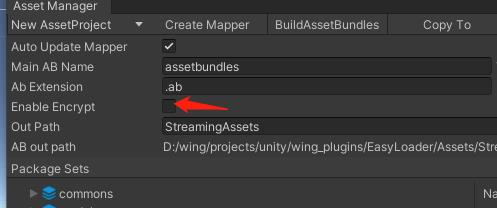
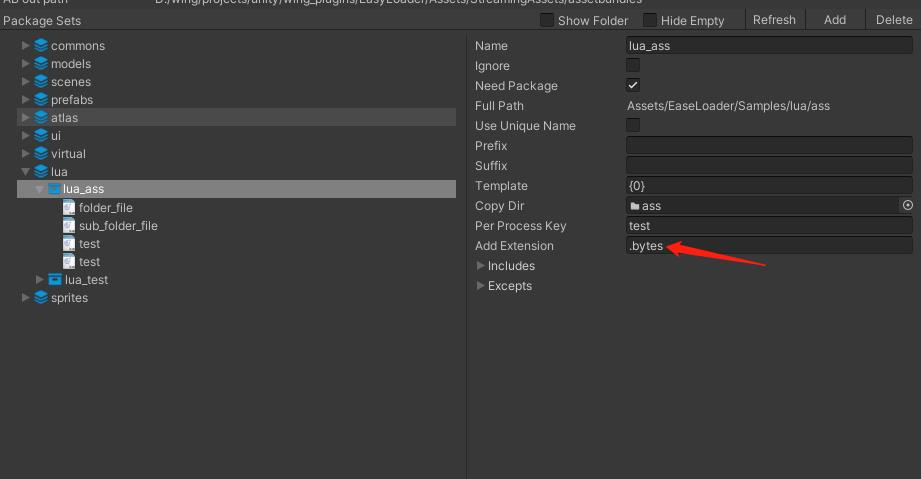

### **Question and Answer** 
***

### mapper.json file missing
use AssetManager tool CreateMapper

### files.txt file missing
use AssetManager tool BuildAssetbunlde

#### can not find assets
***
1. check request paramaters, when you not use unique name mode, you need request with group/package name or you not has extension;   
   Anyway just request with suggestion;
2. maybe you need create mapper again;
3. when USE_BUNDLE mode, maybe you need build asset bundle again;
4. when USE_BUNDLE mode, check if unity asset bundle support the extension; 

#### same name when use unique name
1. add extension for name
2. add prefix/suffix for package files
3. set alias for files
4. rename files

#### how use assets Refrece count  
***
1. set DefaultSettings.enableAutoCollect = true
2. then use load method end with R return RefrenceData
3. when use asset, need invoke RefrenceData.Ref()
4. when unuse asset, need invoke RefrenceData.UnRef()
5. then asset data will auto manager self
6. tips:  
AssetBundle/SpriteAtlas will auto increase refrence count when you call sub asset Ref()

#### how to CI
***
Invoke build method in your Build Pipleline
``` csharp
// add USE_BUNDLE define
BuildTools.EnableUseBundle();
// for package ios assetbundle
BuildHelper.BuildAssetBundle(BuildTarget.iOS, "Assets/[Editor]/**/{your asset project name}.asset");
// for build ios hotfix file
BuildHelper.CreateVersionFiles(RuntimePlatform.IPhonePlayer, "", "Assets/[Editor]/**/{your version asset name}.asset");
```

#### how to use self decrypt
***
1. enable encrypt in asset project, then you can use default encrypt 
 
2. set FileProcessor.customABEncrypt to your own encrypt method **before build asset project**
3. then set ResourceManager.Instance.abDecryptHandler to your own decrypt method **before resource manger initial**

#### how to support unity unsupport extension to assetbundle like lua
*** 
just add **bytes** extension
 

#### how preload assets
```csharp
await ResourceManager.Instance.PreloadAsync(
    new Dictionary<string, EResourceType>()
    {
        {"assetbundles/msic.ab", EResourceType.AssetBundle},
        {"assetbundles/common.ab", EResourceType.AssetBundle},
        {"assetbundles/ui.ab", EResourceType.AssetBundle},
    },
    p => { progress?.Invoke(p);
});
```

### Build tips "The output path "Assets/StreamingAssets/assetbundles" doesn't exist"  
just build again

### Build in demo project
set lua/lua_ass(lua_test)'s copy dir with a empty dir in project to copy lua files


### How to use in WebGL
1. when you not use CDN, just put all building data in you website
   * set RM.assetBaseUrl = Application.streamingAssetsPath
   * build assetbundle by assetmananger
   * build your application by unity
   * upload a build file to your website
2. when you use CDN mode
   * set RM.assetBaseUrl = your cdn base url
   * build assetbundle by assetmananger
   * build your application by unity
   * upload a build application files to your website
   * upload files under streamingAssets to your CDN

### Manager assetbunlde your self 
just use LoaderManager to load assetbunle,  
`support those schema`:  
* res: load assets by Resources path  
* efile: load assets by editor file path  
* file: load assets by local file path  
* http/https: load asset by remote url  