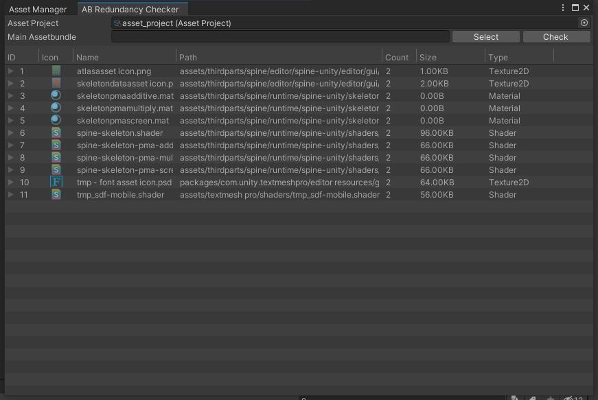

### **ABRedundancyChecker** 
this tool is for checking redundancy assets in assetbundles

#### How To Open
***
* in menu bar Tools/EasyLoader/AB Redundancy Checker
* in Asset Manager Window's tools/AB Redundancy Checker

#### Properties
***
* Asset Project (alternative with Main Assetbundle path)
* Main Assetbundle (alternative with asset project)
* Select 
  select main assetbundle file
* Check
  begin detective redundancy files

### Redundancy Assets
*** 
list all redundancy asset in assetbundles, you can selecte asset items and click right mouse button, then move those assets to a virtual package.