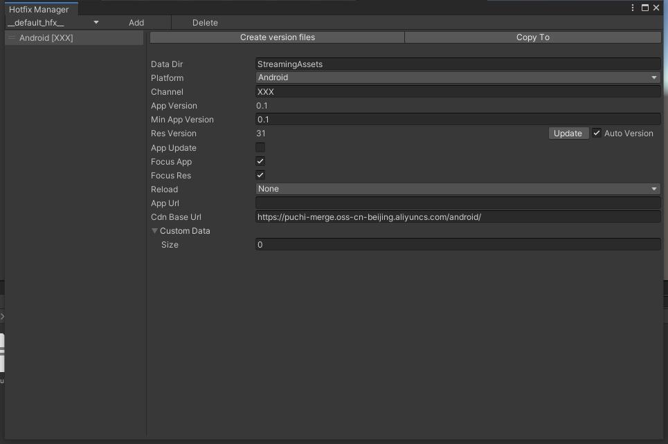

### **Version Manager Window** 


#### How To Open
***
* in menu bar Tools/VersionManager
* use Alt+M
* double click hotfix profile

#### Toolbar
***
* Current Hotfix Profile (Keep last opened profile)
* Add  
add a new version into this profile
* Delete  
delete current selected version
* Create Version files  
create version.json into data dir
* Copy to  
like asset manager's copy to. Just copy all file from DataDir to selected folder

### Properties
***
* DataDir  
the data location folder, default is ok
* Platform  
this version for which platform
* Channel  
this version for which distribute channel, can be empty
* App Version  
the player setting's version (read only)
* Min App Verion  
mininum application version for hotfix this resource version.
* Res Version  
current resource version, can be auto update version by check file md5, or custom set version.
* App Update  
sign if this version has application update in app store 
* Focus App  
sign will focus reinstall when application version is changed.
* Focus Res  
sign will focus hotfix resources when resource version is changed.
* Reload  
set when complated hotfix, then can application do.(developer must do it self)
> * None  
do nothing
> * Reload  
reload resources
> * Restart  
restart application 
* App Url  
url for update application  
* CDN Base Url  
cdn base url for hotfix, support string template:
> * {PLATFORM}
> * {CHANNEL}
> * {RES_VERSION}
* Custom Data
custom keywords for this version

# How to Use #
* Generate version.json file
* Put your project files and version file to CDN
* Use ResourceHotfixer to download files
``` csharp
var baseUrl = $"{CONSTS.CDN_BASE_URL}{platform}/";
var hotfixUrl = $"{baseUrl}version.json";

ResourceHotfixer.Instance.onHotfixProgress += (status, f) =>
{
    progres?.Invoke(f);
};

var result = await ResourceHotfixer.Instance.HotfixAsync(hotfixUrl, baseUrl);
```