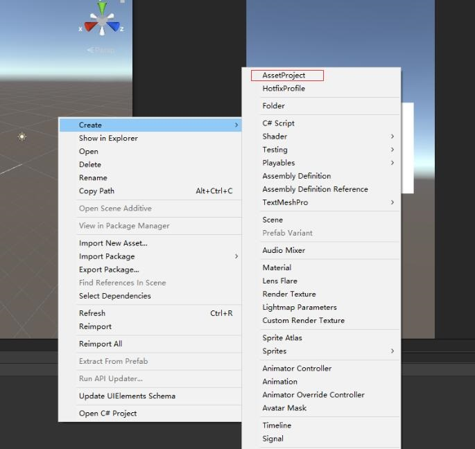
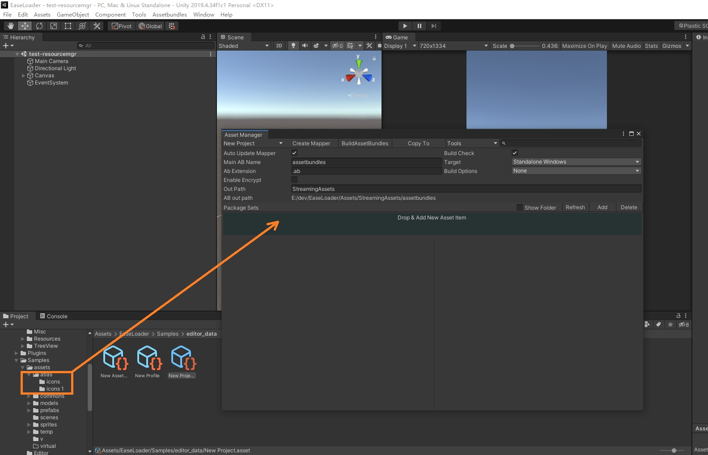
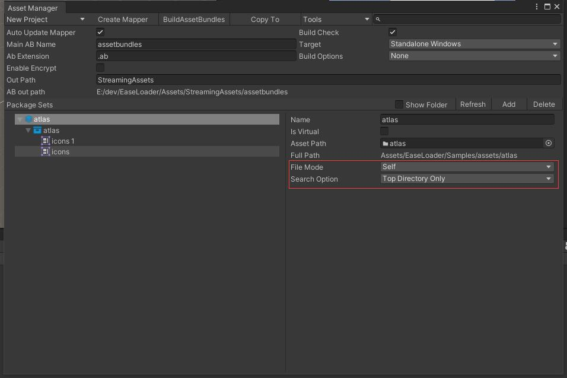
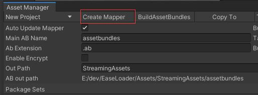
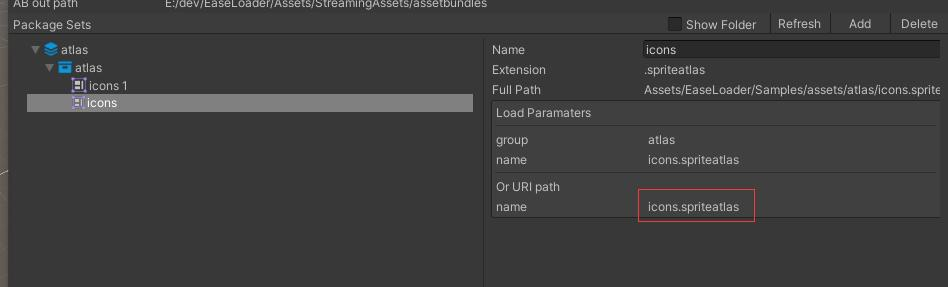
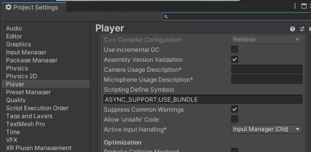

## **EasyLoader**
***
### [AssetStore](https://assetstore.unity.com/packages/slug/215858)
### [Manual](https://wingcd.github.io/EasyLoaderManual)
### [API](./api/html/index.html)

 This is a out-of-the-box asset toolset;
* you can use this for load asset from anywhere, like resources/editor/streaming/persistent data path or web url;
* you can hotfix your assets by hotfix manager with auto resource version

### **Main Features**
***
* Support platform(tested) Android/iOS/Windows/MacOS/WebGL;
* Uniform asset access url and interface;
* Visible asset manager and packer;
* Support without package assetbundle in editor mode;
* Support Editor player assetbundle using, easy to check asset in editor mode;
* Supoort async load;
* Support sync load;
* Support web url load;
* Memory cache support;
* Disk cache support;
* Hotfix manager;
* Redundancy assets checker;

### **Quick Start**
***
* Step 1: Create asset project  


* Step 2: Click asset project then open asset manager, drag asset folder to asset manger window as Package Sets


* Step 3: Set Package Sets' File Mode then get asset packages


* Step 4: Create Mapper file


* Step 5: Initial
``` csharp
// use async mode need add ASYNC_SUPPROT define
await ResourceManager.Instance.InitialAsync();
```

* Setp 6: Load Sprite by path

``` csharp
var sprite = await ResourceManager.Instance.LoadAssetAsync<GameObject>("test.prefab");
```
Or alias name with:
``` csharp
var sprite = await RM.LoadSpriteFromAtlasAsync<Sprite>("icons.spriteatlas", "icon_01.png");
```

### **Build Application**
***
* Add USE_BUNDLE macro in "Player Settings/Scripting Define Symbols"  
  
or use Tools/EasyLoader/EnableUseBundle tool
* Need write some code to copy your files from streamingAssetPath to persistentDataPath, or you can set: ResourceManager.assetFromStreamingAssetPath = true; Then will load data from streamingAssetPath. 
* Build your application.
* When you want async support, please add ASYNC_SUPPROT macro. (Tools/EasyLoader/EnableAsync)

### **Samples**
***
1. demo-thumnail  
LoaderManger demo, load texture from web url 
2. demo-thumnail-async  
LoaderManger demo, load texture from web url by async mode
3. test-resourcemgr  
ResourceManager demo, load asset from editor/assetbundle mode 
4. test-async-resourcemgr  
ResourceManager demo, load asset from editor/assetbundle mode by async mode 
5. demo-virtual-list  
Load texture from web url

### **Files**
***
* AssetProject asset  
a asset project file for manager packages
* HotfixProfile asset  
a asset file for manager hotfixes
* mapper.json  
store all package info, will index file to real location in editor or assetbundle in bundle mode
* files.txt
store all files in streamingpath, for checking copy/download file
* version.json  
store current version info 

#### **Manual**
***
* ### [Global Settings](./manual/global_settings.md)

* ### [Asset Manager](./manual/asset_manager.md)

* ### [Version Manager](./manual/version_manager.md)

* ### [ABRedundancyChecker](./manual/ab_redundancy_checker.md)

* ### [Q&A](./manual/QA.md)

* ### [API](./api/html/index.html)
